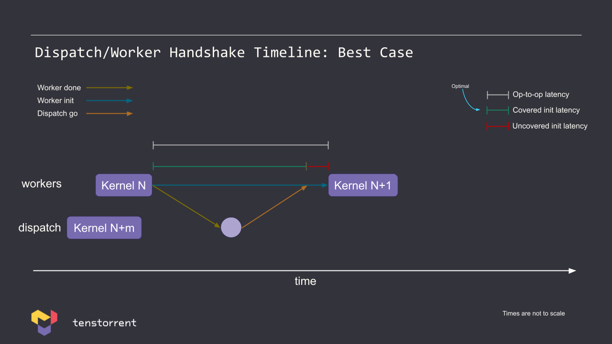
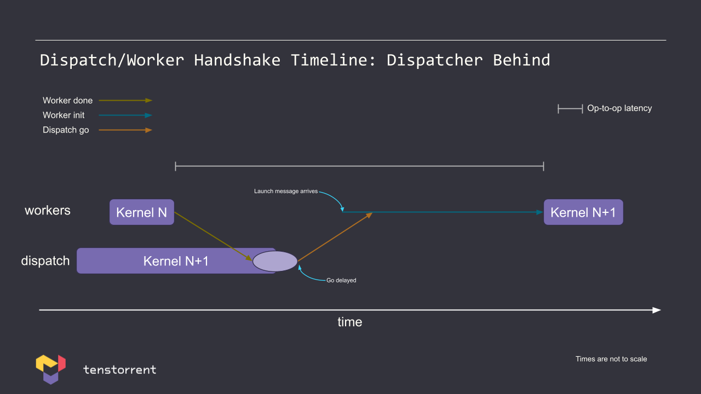
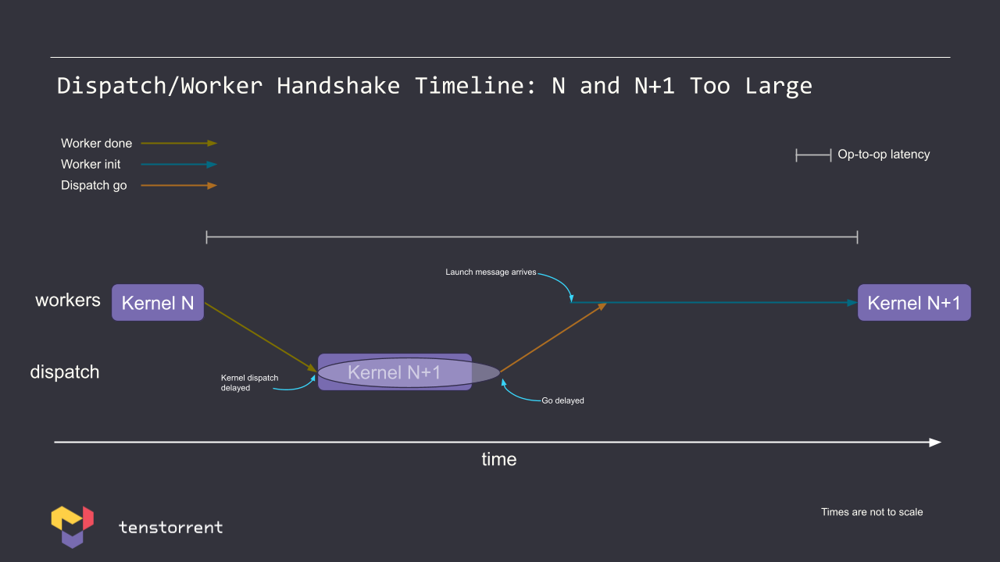
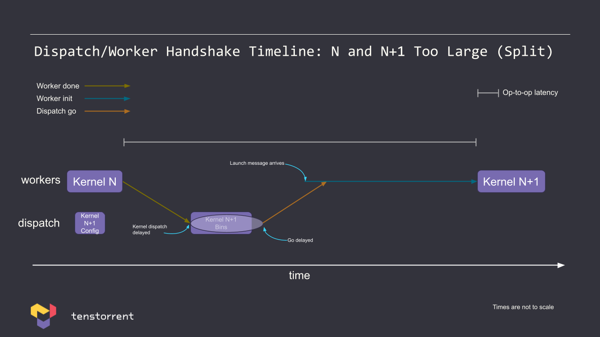
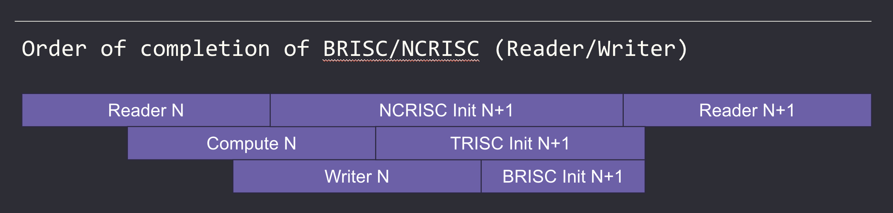

# Op Writer's Guide to Dispatch Overhead

This tutorial covers different methods to optimize dispatch overhead resource allocation, kernel initialization, and runtime arguments. There are many tradeoffs between these optimization methods and not one single optimization will benefit all scenarios in the same way. It is up to the developer to determine which optimizations can be best applied to their unique scenario. Finding a balance between these optimization methods requires experimentation.

## Dispatch Time Tradeoffs

When optimizing dispatch time, there is no one-size-fits-all formula. The ideal dispatch strategy depends on your specific workload and performance goals. It’s a balancing act between responsiveness, throughput, and resource contention. Finding the right dispatch timing typically involves some trial and error, with careful attention to system behavior and performance metrics.

## Fast Dispatch Primer

To understand how fast dispatch works, it’s helpful to break down the core communication mechanisms between the dispatch system and worker cores. There are two primary messages involved in this process:

### 1. Launch Message

The launch message indicates that it is safe to launch a kernel. It prepares the worker core to execute a kernel, but does not initiate execution immediately.
- **Who sends it?** Sent from the dispatch unit to the worker cores.
- **When is it sent?** After all kernel data has been transmitted, but before actual execution begins.
- **Execution relation:** Asynchronous — the launch message is decoupled from kernel execution.
- **What does it contain?** Kernel metadata such as:
    - Kernel ID (k_id)
    - Number of circular buffers
    - Number of runtime arguments
    - Other configuration details necessary to set up execution

This message essentially tells the worker: “Here’s everything you need to know to get ready.”

### 2. Go Message

The go message signals that it is now safe to execute the kernel. This is the final trigger that causes the worker to begin execution.
- **Who sends it?** Sent from dispatch_s to the worker cores.
- **When is it sent?** Only after the previous kernel has completed and the system has received a “done” signal.
- **Execution relation:** Synchronous — the go message is tightly coupled with the start of kernel execution.
- **What does it contain?** Simply: "go"

This message is essentially the green light: “Everything’s ready — go execute now.”

## Fast Dispatch Timeline

Understanding the Fast Dispatch process requires a look at the timeline of events between the dispatcher and the worker cores. This timeline highlights the overlapping and sequential actions that enable efficient kernel execution.

### Step-by-Step Timeline:
	1.	Worker Executes Kernel
While a worker core is actively executing a kernel, the dispatcher is already preparing future kernels. This overlapping activity helps maximize system utilization and throughput.
	2.	Kernel Completion
Once the worker finishes executing a kernel, it sends a “done” signal back to the dispatcher. This marks the official end of the current kernel’s execution.
	3.	“Done” Received → “Go” Sent
After receiving the “done” message, the dispatcher responds by sending the “go” message for the next kernel. This message gives the worker the green light to begin execution of the next prepared kernel.
	4.	Worker Local Initialization
During this “done” → “go” handshake, the worker core performs its own local initialization for the next kernel. This setup includes any configuration or pre-execution work needed on the worker side.
	5.	Latency Consideration: Covered vs. Uncovered
Ideally, the worker’s initialization completes within the handshake window (from “done” to “go”). If it doesn’t, the extra time required becomes uncovered latency — an inefficiency that delays kernel execution.
	•	Covered latency: Initialization fits within the handshake period → optimal.
	•	Uncovered latency: Initialization exceeds handshake time → suboptimal but potentially fixable through optimization.

### Timing Insight

In an ideal case, the time between the “done” signal and the “go” message is approximately 700 nanoseconds. This is already fast, but ongoing system improvements aim to reduce this latency even further, unlocking additional performance gains.

This step-by-step timeline illustrates how the dispatch mechanism is designed for concurrency, but also where inefficiencies can creep in — giving you concrete opportunities for tuning and optimization.

## Common Fast Dispatch Scenarios

While the fast dispatch mechanism is designed for efficiency, real-world workloads often present variations that deviate from the ideal case. Understanding these scenarios can help you diagnose performance issues and identify opportunities for optimization.

### 1. Best-Case Handshake Timing



In the best-case scenario, the dispatcher and worker cores are perfectly synchronized:
- The worker finishes executing a kernel and sends the “done” message.
- The dispatcher is already prepared and quickly sends the “go” message for the next kernel.
- Worker local initialization begins immediately and finishes within the handshake window.
- Kernel execution starts without delay.

This is the most efficient path, with minimal latency and high throughput.

### 2. Dispatcher Behind

This suboptimal scenario can occur when you have multiple short-duration kernels executing in rapid succession.



**What happens:**
- The worker finishes a kernel and sends “done”.
- The dispatcher is still catching up — the launch message for the next kernel is delayed.
- Because of the delay, worker initialization starts late.
- As a result, kernel execution is pushed out, increasing end-to-end latency.

This scenario shows how tight workloads with small kernels can expose dispatcher lag.

### 3. Kernel Size Mismatch: N and N+1 Too Large

This scenario arises when the current and next kernels — Kernel N and Kernel N+1 — are too large to fit into the worker’s ring buffer simultaneously.



**What happens:**
- Kernel N is still occupying the ring buffer.
- The dispatcher cannot send Kernel N+1 until Kernel N completes and its data is cleared.
- This results in a dispatch stall, with delayed go message and increased latency.

**Symptoms:**
If you’re seeing dispatch times in the range of 7–15 microseconds, you’re likely encountering this issue.

**Optimization Effort:** Partial Fit of Kernels

Tenstorrent is actively optimizing this scenario. The goal is to allow partial overlap: even if both kernels can’t fully fit into the ring buffer, some of Kernel N+1’s data might fit alongside Kernel N’s data.



This enables earlier dispatch of Kernel N+1, reducing stalls and improving pipeline efficiency.

By understanding these common dispatch timing scenarios — from ideal to challenging — you’ll be better equipped to interpret system behavior, spot bottlenecks, and apply targeted optimizations in your kernel scheduling.

## Resource Contention

In the fast dispatch model, kernel dispatch overlaps with kernel execution. This concurrency improves performance, but it also introduces resource contention between the dispatch logic and the execution pipeline.

Key Insight:
- **Dispatch isn’t free**. It consumes shared system resources while previous kernels are still running.
- As a result, dispatch activity can interfere with kernel execution, especially in workloads that are:
    - DRAM-bound
    - NoC-bound (Network-on-Chip)

On the other hand, compute-bound kernels are generally unaffected by dispatch overhead since they do not rely heavily on shared bandwidth or memory.

**Optimization Tip:** To improve execution performance, pay attention to dispatch costs — especially in memory-heavy workloads. DRAM access, memory bandwidth (BW), and dispatch operations all compete for system resources and can create contention bottlenecks.

## Asynchronous Dispatch

One of the strengths of Tenstorrent’s dispatch model is that it is asynchronous — meaning the dispatch of future kernels overlaps with the execution of current ones.

**Example:** The dispatch of Kernel N+m can begin while Kernel N is still executing.

### When Asynchronous Dispatch Stalls

Asynchronous dispatch isn’t limitless. It can stall under the following conditions:
- **Too many kernels ahead:** If m > 6 (i.e., you’re dispatching more than 6 kernels ahead of the one currently executing).
- **Ring buffer full**: If the kernel ring buffer on the worker is full, the dispatcher must wait before sending more kernels.

### Ring Buffer Details:
- The ring buffer is currently statically set to 70 KB.
- A larger ring buffer would allow for deeper dispatch queues (more kernels in-flight), improving dispatch flexibility — but at the cost of tensor data capacity.
- Future roadmap: Tenstorrent plans to allow configurable ring buffer sizes, enabling users to tune this tradeoff based on workload characteristics.

## Firmware Kernel Initialization

Before a kernel can execute, the firmware performs a set of initialization steps. These ensure that the worker core and its environment are ready for correct execution.

### Firmware Initialization Steps:
1.	**Copy Kernel to IRAM:** On Wormhole platforms, the worker (NCRISC) copies the kernel binary from L1 memory to IRAM.
2.	**Initialize Circular Buffers (CBs):** Sets up both local and remote CBs required for kernel communication and data movement.
3.	**Initialize Networks-on-Chip (NoCs):** Prepares the NoC fabric for efficient data routing during kernel execution.
4.	**Initialize Global Variables:** Sets up static variables and other global state in local memory, ensuring a consistent environment for kernel logic.

Understanding how dispatch behavior interacts with system resources and how the firmware sets the stage for execution is key to optimizing both dispatch latency and kernel performance.

## Worker Initialization: NCRISC (Wormhole Platform)

On Wormhole, the NCRISC worker core executes its kernel binary directly out of IRAM (Instruction RAM). Before execution can begin, the kernel binary must be copied from L1 memory into IRAM, and this copy operation introduces a measurable delay.

### Kernel Copy Performance

The copy process runs at approximately 10 bytes per cycle, and the size of the kernel binary directly impacts the time required for initialization.

| Scenario               | Binary Size | Estimated Cycles  | Time (at 10 bytes/cycle) |
|:-----------------------|------------:|------------------:|-------------------------:|
| Best case              | ~2 KB       | ~200 cycles       | ~200 ns                  |
| Common case            | ~4 KB       | ~400 cycles       | ~400 ns                  |
| Worste case (overflow) | ~16 KB      | ~1600 cycles      | ~1600 ns                 |


**Tip:** If the NCRISC kernel binary is larger than the BRISC kernel binary, consider swapping roles so the smaller binary is placed on BRISC. This minimizes IRAM copy time on NCRISC.

**Note for Blackhole users:** The Blackhole platform does not use IRAM, meaning the kernel binary doesn’t need to be copied — eliminating this initialization delay entirely.

## BRISC vs. NCRISC: Order of Completion for Reader/Writer Kernels

In typical data movement pipelines, the Reader, Compute, and Writer roles are mapped to different kernels. The execution order of these roles influences performance, especially when placed on different cores.

### Common Execution Flow



1. **Reader:** Loads data into the system.
2. **Compute:** Processes the data.
3. **Writer:** Sends processed data onward (e.g., to DRAM or another kernel).

In most cases:
- The Reader finishes before Compute.
- Compute finishes before the Writer.

### Optimization Strategy

Place the Reader kernel on NCRISC and the Writer on BRISC, for these reasons:
- Once the Reader completes and the launch message for the next kernel has already arrived, NCRISC can start copying the binary for Kernel N+1 immediately.
- Writers tend to be larger and more complex — putting them on BRISC avoids the IRAM copy delay on NCRISC.
- Readers are typically smaller, meaning faster IRAM copy on NCRISC.

This pairing allows NCRISC to do its copy work while the Writer (on BRISC) is still completing its part of the previous kernel, improving overall throughput.

### When This Optimization Doesn’t Work

If your workload is affected by one of the following issues, this optimization can backfire:
- **Dispatcher is behind:** Delayed launch/go messages prevent early copy.
- **Kernel N and N+1 can’t fit together in the ring buffer:** Dispatch stalls, and NCRISC can’t begin IRAM copy early.
- **Result:** BRISC (Writer) idles, and NCRISC (Reader) is delayed — leading to execution inefficiencies.

#### Mitigation Strategies

To avoid this slowdown:
- Ensure the dispatcher’s ring buffer is sized appropriately and can hold both Kernel N and N+1 together.
- If this isn’t feasible, reverse the roles:
    - Put the Reader on BRISC.
	- Put the Writer on NCRISC.
This way, you sidestep the IRAM copy delay for the Reader and ensure better pipeline flow under suboptimal dispatch conditions.

## Worker Initialization: Circular Buffer (CB) Configurations

During worker initialization, CB (Circular Buffer) configuration is another source of latency. The number and layout of CBs significantly affect how long it takes to initialize a kernel.

### CB Config Initialization Times

| Platform   | Time per CB Config | Worst Case (32 CBs) |
|------------|---------------------|----------------------|
| Wormhole   | ~25 cycles          | ~800 ns              |
| Blackhole  | ~20 cycles          | ~640 ns              |

### Current Behavior (Wormhole)
- NCRISC initializes CBs *after* binary copy into IRAM.
- In the worst-case scenario, this adds up to ~2400 cycles, or ~2400 ns total for both operations (binary copy + CB config).

### Upcoming Improvement
- NCRISC will begin initializing CBs concurrently with the binary copy.
- Once implemented, total initialization time will be bounded by binary copy time, improving startup performance for kernels with many CBs.

### Optimization Tips
- Avoid requesting CBs that aren't used by the kernel.
- Pack CB indices efficiently to minimize overhead — unnecessary spacing increases setup cost.

## Number of Kernel Groups

A **kernel group** is a set of cores that receive the same kernel binaries. This concept is crucial for efficient dispatch and minimizing NoC (Network-on-Chip) bandwidth usage.

### What Defines a Kernel Group?
- Kernels that share identical binaries (e.g., Data Movement 0, Data Movement 1, Compute) can be dispatched together as a single kernel group.
- However, any variation in compile-time arguments or defines produces separate binaries, even if sourced from the same codebase — thus creating multiple kernel groups.

### Dispatch Implications

- The Dispatcher loops through each kernel group, sending the corresponding binary via multicast.
- More kernel groups = more dispatch work and higher NoC bandwidth usage.
- Binary sizes can reach up to 8 KB, and large binary copies cannot be overlapped with prior kernel execution.

### Optimization Advice

If you're using compile-time arguments to tune behavior, consider this tradeoff:
- **Pros:** May improve performance for a specific use case.
- **Cons:** Increases the number of kernel groups, dispatch time, and NoC traffic.

If the same effect can be achieved with runtime arguments, you’ll reduce kernel group proliferation and improve dispatch performance.

## Physical Layout of Kernel Groups

The **physical arrangement** of cores in your kernel group also affects how dispatch works — particularly when your groups aren’t rectangular.

### Wormhole: Rectangular MCast Blocks Only

On **Wormhole**, multicast operations are limited to rectangular core groups. As a result:
- Non-rectangular shapes (e.g., L-shaped layouts) must be split into multiple rectangular multicast blocks.
- For example, a single L-shape might become two or more kernel groups, increasing dispatch effort and memory traffic.


In the diagram above, what might look like a single logical group becomes:
- 2 rectangular kernel groups for the L-shaped region (green + purple),
- 1 group for the isolated orange core — for a total of 3 kernel groups.

### Blackhole: Flexible Multicast

In contrast, Blackhole supports multicast to L-shaped core layouts:
- The same configuration would only result in 2 kernel groups.
- This improves dispatch efficiency and reduces kernel group overhead.

## NoC Flits

The NoC sends data via **Flow Control Units (flits)**.
- On Wormhole, one flit is 32 bytes.
- On Blackhole, one flit is 64 bytes.
- A flit is processed in 1 cycle.

### Bandwidth Calculation Examples:
- **Wormhole**: `1 GHz * 32 bytes/cycle = 32 GB/s`
- **Blackhole**: `1 GHz * 64 bytes/cycle = 64 GB/s`

Each transaction includes **1 flit header**, and the minimal transaction is **2 flits**.

Example diagrams:
- Minimal transaction with header flit:
  
- 128B payload with 32B header (160B total):
  


## Wormhole: RTA Performance (Sending to 8x8 Grid)

 <!-- need to ask for updated diagram -->

- The first runtime argument (RTA) incurs a high cost.
- Adding RTAs is bottlenecked by RISC-V and can take many cycles.
- After about 36 RTAs, cycle cost begins increasing in a stair-step pattern due to flit size alignment.

### Runtime Argument Details:
- Each RTA is 4 bytes.
- The first argument adds an entire flit (32 bytes).
- Additional RTAs are effectively "free" until they exceed the 32B limit.
- NoC bandwidth consumption increases every 8 RTAs, even if duration stays flat.

If you're bandwidth-bound and using many RTAs:
- Dispatch cost may remain flat.
- However, you may interfere with prior kernel execution due to increased NoC usage.

### Optimization Tip:
- If multiple cores share the same RTAs, consider multicasting. Multicasting increases dispatch cycles but reduces NoC bandwidth usage.
- Unique RTAs use fewer dispatch cycles but higher bandwidth.
- Decide based on your scenario whether unique or common RTAs are optimal.

## RTAs vs Kernel Groups

One common pattern is to use runtime arguments (RTAs) to allow local cores to decide which execution path to follow. This replaces compile-time decisions (which require unique kernel binaries) with dynamic decisions at runtime. For example, if you have a ~2K kernel binary and add an RTA so the same binary can be reused across many cores, and the binary size only increases slightly (e.g., 2K → 2.1K), then that's a great tradeoff. However, if you're using a large monolithic "god kernel" that is already 8K, the benefits of adding RTAs may not outweigh the costs.

### RTAs

- Steep initial cost for the first RTA
- Subsequent RTAs are effectively free until the flit boundary is exceeded
- But the cost can add up!
    - Example: 256 RTAs × 4 B/arg × 3 kernels × 64 cores = 196 KB!
    - ~100 µs dispatch time from host (at 2 GB/s on Galaxy) — very expensive!
    - ~10 µs dispatch time from DRAM for a trace
- Use RTAs to configure kernel behavior dynamically
    - Better than creating separate kernels
    - Not likely beneficial for large, complex ("god") kernels with no code reuse

### Kernel Groups

- **Costly for dispatch**: More kernel binaries means more data sent over NoC
- **Improves kernel execution time**: Fewer conditionals, more optimized execution paths

## Global Initialization (Minor Optimization)

It's more efficient to statically initialize global variables rather than initializing them inside the kernel function. This won't cause major savings, but it's a good best practice.

### Bad Example

```c
static int x = 0;
static int y = 0;
static int z = 0;

void kernel_main()
{
    x = 32;
    y = 23;
}
```

Why it’s bad:
- Assignments in the kernel are costly
- Load/store operations add at least 8 bytes of instructions
- Larger binary size
- Initializing 4 bytes may take up to 12 bytes of instructions
- Don’t zero-initialize unless you actually need zeros

### Better Example

```c
static int x = 32;
static int y = 23;
static int z;

void kernel_main()
{
}
```

Why it’s better:
- Static initialization is cheaper
- Densely packed and copied as a block during load time
- Avoids unnecessary instruction overhead

## T3K (Ethernet Dispatch)

On T3K, dispatch is typically handled by Ethernet cores, in contrast to other platforms where dispatch is performed by Tensix cores. It's important to note that **Ethernet dispatch will never match the performance of Tensix dispatch** due to architectural limitations.

### Tensix Dispatch

- **L1 Cache**: 1.5MB
- **RISC-V Cores**: 5

Tensix dispatch benefits from larger L1 memory and multiple RISC-V cores, enabling high-throughput dispatch and better concurrency with worker execution.

### Ethernet Dispatch

- **L1 Cache**: 256KB
- **RISC-V Cores**: 1
- Minimal dispatcher buffering
- Undersized prefetcher buffers

Due to limited resources, Ethernet dispatch has reduced throughput and higher latency. These constraints make it less suited for workloads requiring aggressive dispatch timelines or tight synchronization.

### Future Outlook

Optimizations for Ethernet dispatch are on the roadmap, but they are currently lower in priority. Even with improvements, Ethernet dispatch will not reach the performance levels of Tensix dispatch.

If you're targeting T3K, be aware of these limitations and design your dispatch strategy accordingly to mitigate bottlenecks.

## Conclusion

Fast dispatch and efficient kernel execution are critical to maximizing performance on Tenstorrent hardware. By understanding the interplay between the dispatcher, worker initialization, kernel group configuration, runtime arguments, and NoC bandwidth, developers can make informed decisions that minimize dispatch overhead and optimize data movement.

Key takeaways include:
- Minimizing uncovered latency through proper initialization timing
- Strategically using RTAs to reduce kernel binary duplication
- Being mindful of kernel group layout and compile-time argument impact
- Optimizing global initialization, CB configs, and ring buffer usage

Continual profiling and fine-tuning based on your workload’s behavior will help you unlock the full potential of the Tenstorrent architecture.


